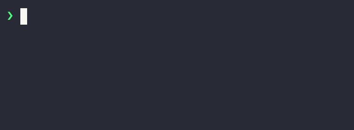
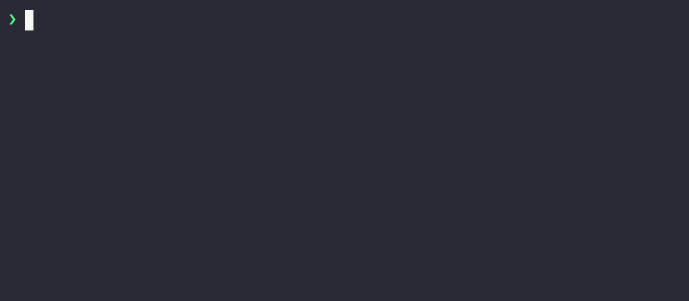

# PyApp

| | |
| --- | --- |
| CI/CD | [{ loading=lazy .off-glb }](https://github.com/ofek/pyapp/actions/workflows/test.yml) [{ loading=lazy .off-glb }](https://github.com/ofek/pyapp/actions/workflows/publish.yml) |
| Docs | [{ loading=lazy .off-glb }](https://github.com/ofek/pyapp/actions/workflows/docs-latest.yml) [{ loading=lazy .off-glb }](https://github.com/ofek/pyapp/actions/workflows/docs-dev.yml) |
| Project | [{ loading=lazy .off-glb }](https://crates.io/crates/pyapp) [{ loading=lazy .off-glb }](https://crates.io/crates/pyapp) [{ loading=lazy .off-glb }](https://github.com/ofek/pyapp/releases) |
| Meta | [{ loading=lazy .off-glb }](https://github.com/pypa/hatch) [{ loading=lazy .off-glb }](https://spdx.org/licenses/) [{ loading=lazy .off-glb }](https://github.com/sponsors/ofek) |

-----

PyApp is a wrapper for Python applications that bootstrap themselves at runtime.

| You build |
| :---: |
| { loading=lazy role="img" } |

| User runs |
| :---: |
| { loading=lazy role="img" } |

See the [how-to](how-to.md) for a detailed example walkthrough.

## Features

- Easily build standalone binaries for every platform
- Optional management commands providing functionality such as self updates
- Extremely configurable runtime behavior allowing for targeting of different end users

## License

PyApp is distributed under the terms of any of the following licenses:

- [Apache-2.0](https://spdx.org/licenses/Apache-2.0.html)
- [MIT](https://spdx.org/licenses/MIT.html)

## Navigation

Documentation for specific versions can be chosen by using the dropdown on the top of every page. The `dev` version reflects changes that have not yet been released.

Desktop readers can use special keyboard shortcuts:

| Keys | Action |
| --- | --- |
| <ul><li><kbd>,</kbd> (comma)</li><li><kbd>p</kbd></li></ul> | Navigate to the "previous" page |
| <ul><li><kbd>.</kbd> (period)</li><li><kbd>n</kbd></li></ul> | Navigate to the "next" page |
| <ul><li><kbd>/</kbd></li><li><kbd>s</kbd></li></ul> | Display the search modal |
