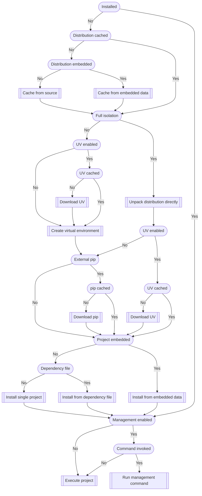

# Runtime behavior

-----

## Initialization

Applications will bootstrap themselves on the first run. All subsequent invocations will only check if the installation directory exists and nothing else, to maximize CLI responsiveness.

!!! note
    The following diagram shows the possible behavior at runtime. The nodes with rounded edges are conditions and those with jagged edges are actions.

    Most nodes are clickable and will take you to the relevant documentation.



## Execution

Projects are [executed](config.md#execution-mode) using [`execvp`](https://linux.die.net/man/3/execvp) on non-Windows systems, replacing the process.

To provide consistent behavior on each user's machine:

- Python runs projects in [isolated mode](https://docs.python.org/3/using/cmdline.html#cmdoption-I)
- When installing or upgrading projects, [pip](https://github.com/pypa/pip) uses [isolation](https://pip.pypa.io/en/stable/cli/pip/#cmdoption-isolated) ([by default](config.md#allowing-configuration))

## Detection

A single environment variable called `PYAPP` is injected with the value of `1` ([by default](config.md#installation-indicator)) when running applications and may be used to detect this mode of installation versus others.

## Location

The default location of your application's installation differs based on the operating system and can be overridden at runtime with the `PYAPP_INSTALL_DIR_<PROJECT_NAME>` environment variable where `<PROJECT_NAME>` is the uppercased version of the [project name](config.md#project).

## Commands

Built applications have a single top-level command group named `self` ([by default](config.md#management-command)) and all other invocations will be forwarded to your actual [execution logic](config.md#execution-mode).

### Default

These commands are always exposed.

#### Restore

```
<EXE> self restore
```

This will wipe the installation and start fresh.

#### Update

```
<EXE> self update
```

This will update the project to the latest available version in the currently used distribution.

### Optional

These commands are hidden by default and each can be individually exposed by setting its corresponding `PYAPP_EXPOSE_<COMMAND>` option (e.g. `PYAPP_EXPOSE_METADATA`) to `true` or `1`.

#### Metadata

```
<EXE> self metadata
```

This displays [customized](config.md#metadata-template) output based on a template.

#### pip

```
<EXE> self pip
```

This directly invokes pip with the installed Python.

#### Python

```
<EXE> self python
```

This directly invokes the installed Python.

#### Python path

```
<EXE> self python-path
```

This outputs the path to the installed Python.
